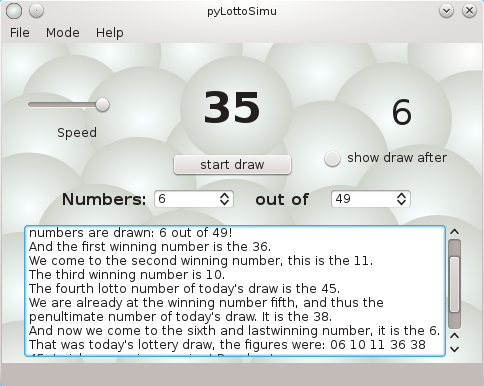

pyLottoSimu
===========


[]
(https://github.com/MarkusHackspacher/pyLottoSimu/blob/master/LICENSE)
[]
(https://gitter.im/MarkusHackspacher/pyLottoSimu?utm_source=badge&utm_medium=badge&utm_campaign=pr-badge&utm_content=badge)
[]
(https://readthedocs.org/projects/pylottosimu/?badge=latest)
[]
(https://drone.io/github.com/MarkusHackspacher/pyLottoSimu/latest)

Lotto Generator und Simulator

a simulation of Lotto Germany (pick 6 out of 49), Lotto Austria (pick 6 out of 45), EuroMillionen, Powerball Lottery US and Mega Millions lottery system.

install
-------

The program requires [Python 2.7 or 3.x](http://www.python.org/download/) 
and [Qt5 for Python](http://www.riverbankcomputing.com/software/pyqt/download5).

Start with

`python lotto.pyw [de|fr|es|it|ru]`

Make the documentation as .html file:

```
cd docs
make html
```

To translate the program or make a translation in your language,
insert in the complete.pro your language code.

```
cd pylottosimu
pylupdate4 complete.pro
```

translate your language file: lotto1_xx.ts, and produce the .ts translation files with

`lrelease complete.pro`



Bedienen
--------

Modus Zufallsgenerator:
Die Zahlen auswählen und mit 'Zufallsgenerator ein' starten

Modus Simulation:
Die Zahlen auswählen und mit 'Start' die Simulation starten.
Dabei kann mit dem Schieber oben links die Geschwindigkeit verändert werden.

")

License
-------

GNU GPL V3
